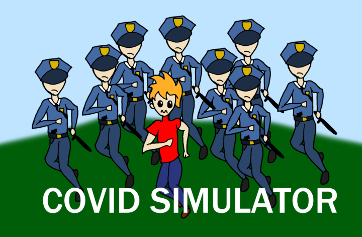

# COVID-19 Simulator

A game made for the 3rd of August Godot game workshop.

Background tile sheet was from [here](https://opengameart.org/content/roguelikerpg-pack-1700-tiles)
and the characters were from [here](https://opengameart.org/content/16x16-8-bit-rpg-character-set)

Have fun, make pull requests.
